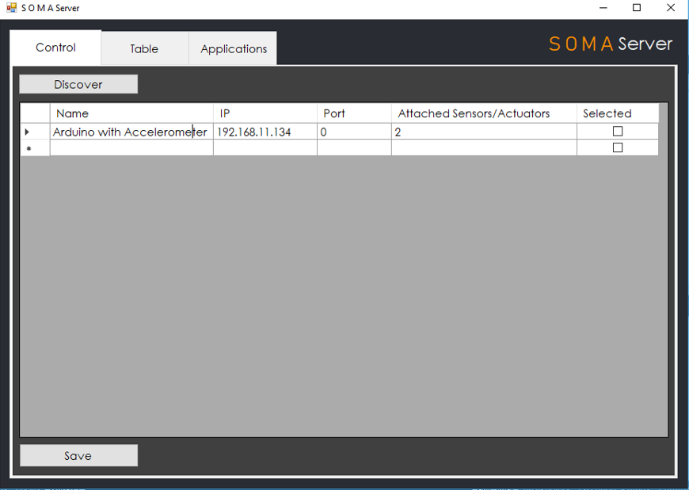

# SOMA Server
SOMA Server is a server side application which can automatically discorver all the SOMA devices in a network. After discovering it can route sensors and actuators to respective devices based on the user suppied routing information.

## Usage

Press the Discover button to discover all the SOMA devices in a network.

Click on the name of the device to check the attached sensors and actuators 

## For Developers
SOMA Server is developed on top of Visual Studio 2017.
 
SOMA Server uses Mono.Zeroconf for discover of devices which is a Zero Configuration Networking library .NET
The easiest way to get started is to use the NuGet package.

> Install-Package [Zeroconf](http://www.nuget.org/packages/Zeroconf)

More detailed docmentation will come shortly